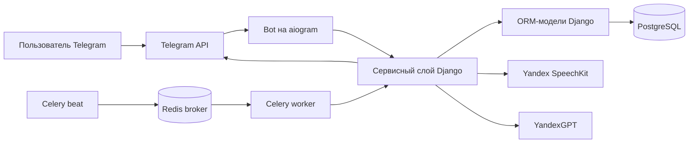
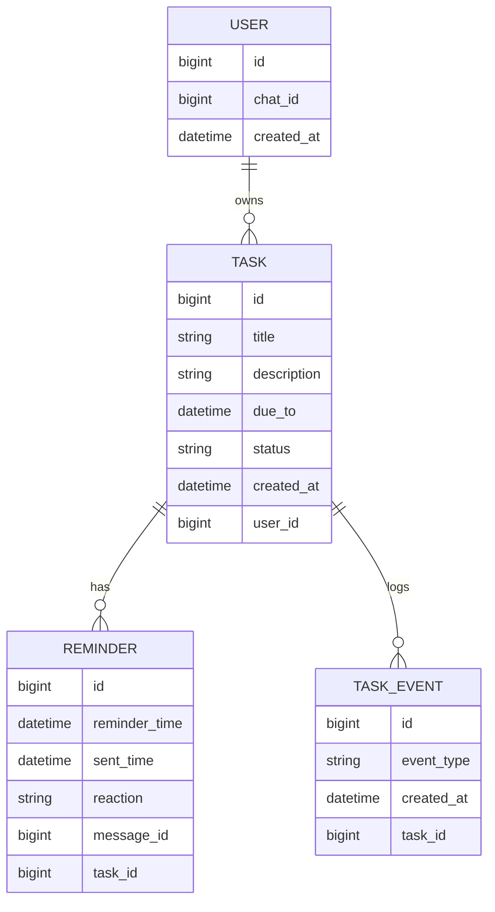
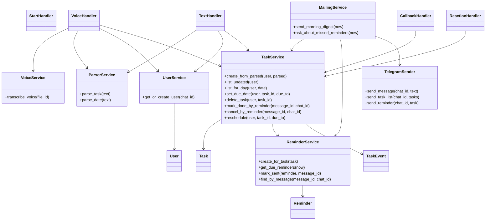

# Архитектура проекта «Голосовой напоминальщик»

Этот документ описывает архитектуру учебного Telegram-бота: какие модули нужны, как они взаимодействуют и где писать код. Подробные требования, сценарии и пайплайны лучше держать в отдельных документах, а здесь оставить общую картину реализации.

Диаграмма компонентов: [`ARCHITECTURE.drawio`](../ARCHITECTURE.drawio) в корне репозитория.

## 1. Что строим

Проект - Telegram-бот, который помогает пользователю быстро создавать напоминания голосом или текстом.

Базовый поток:

1. Пользователь отправляет сообщение в Telegram.
2. Бот получает `chat_id`, текст или голосовой файл.
3. Голос распознается в текст через Speech-to-Text.
4. Текст разбирается в структуру задачи.
5. Django сохраняет задачу, напоминание и события в PostgreSQL.
6. Celery по расписанию отправляет дайджесты и точечные напоминания.
7. Пользователь реагирует на напоминание, а система меняет статус задачи.

Главное архитектурное правило: Telegram handlers, Celery tasks и внешние API не должны содержать бизнес-логику. Они только принимают событие, вызывают сервис и возвращают результат.

## 2. Компоненты



Ответственность компонентов:

- `aiogram bot` принимает команды, голос, текст, inline-кнопки и реакции.
- `Django app` хранит модели, миграции, сервисы, настройки и команды запуска.
- `PostgreSQL` хранит пользователей, задачи, напоминания и историю событий.
- `Redis` используется как broker для Celery, а не как постоянное хранилище.
- `Celery beat` запускает фоновые задачи по расписанию.
- `Celery worker` выполняет фоновые задачи и вызывает сервисы.
- `Yandex SpeechKit` превращает голос в текст.
- `YandexGPT` превращает свободный русский текст в поля задачи.

Если данные нельзя потерять после перезапуска, они должны быть в PostgreSQL.

## 3. Слои приложения

### Telegram Handlers

Handlers должны быть тонкими. Их задача:

1. Получить update от Telegram.
2. Достать `chat_id`, текст, голос, callback или реакцию.
3. Вызвать подходящий сервис.
4. Отправить ответ пользователю.

В handlers не пишем SQL-запросы, сложные проверки статусов, создание связанных объектов и правила повторных отправок.

Примеры handlers:

- `start.py` - команда `/start`;
- `voice.py` - голосовые сообщения;
- `text.py` - текстовые сообщения и ввод даты;
- `undated.py` - список задач без даты;
- `callbacks.py` - inline-кнопки;
- `reactions.py` - реакции на напоминания.

### Сервисный слой

Сервисы группируются по сущностям и крупным областям, а не по каждому маленькому действию. Для учебного проекта лучше иметь несколько понятных сервисов, чем много узких классов.

Основные сервисы:

- `UserService` - найти или создать пользователя по `chat_id`.
- `TaskService` - создать задачу, показать списки, назначить дату, удалить, завершить, отменить, перенести и записать события задачи.
- `ReminderService` - создать напоминание, выбрать наступившие напоминания, отметить отправку, связать напоминание с Telegram `message_id`.
- `MailingService` - подготовить утренний дайджест и вечерний вопрос о переносе.
- `VoiceService` - скачать voice-файл, проверить ограничения, вызвать STT и вернуть распознанный текст.
- `ParserService` - вызвать YandexGPT или mock-parser и вернуть нормализованные поля задачи.

Важный момент: `TaskService` - единая точка для правил вокруг задач. Не нужно делать отдельный сервис на каждое действие с задачей. Такие методы должны жить внутри одного `TaskService`.

### Integrations

Интеграции прячут внешние API за простыми классами:

- `TelegramFileClient` - скачать voice-файл из Telegram.
- `TelegramSender` - отправить сообщение, список задач или inline-кнопки.
- `YandexSpeechKitClient` - распознать аудио.
- `YandexGPTClient` - разобрать текст задачи.

Такой слой нужен, чтобы в тестах заменить внешние API на mock-объекты.

### Celery Tasks

Celery tasks тоже должны быть тонкими:

1. Получить текущее время.
2. Вызвать `ReminderService` или `MailingService`.
3. Отправить сообщения через `TelegramSender`.
4. Записать результат и лог.
5. При временной ошибке сделать retry, если это безопасно.

Бизнес-логика выбора задач, смены статусов и защиты от дублей должна быть в сервисах, а не внутри Celery task.

## 4. Модель данных

Минимальная модель состоит из четырех сущностей.



### `User`

Пользователь Telegram. В MVP он определяется по уникальному `chat_id`. Логин, пароль и email не нужны.

### `Task`

Основная сущность проекта. У задачи есть название, описание, дата напоминания и статус.

Рекомендуемые статусы:

- `active` - задача актуальна;
- `done` - пользователь поставил положительную реакцию;
- `cancelled` - пользователь отменил задачу;
- `deleted` - пользователь удалил задачу через кнопку.

Удаление лучше делать логическим: запись остается в БД, но получает статус `deleted`.

### `Reminder`

Конкретное напоминание по задаче. Оно нужно, чтобы понимать, когда отправлять сообщение, было ли оно отправлено и на какое Telegram-сообщение пришла реакция.

Для надежности можно добавить поля `status`, `attempts`, `last_error`, `locked_at`, но для первого варианта достаточно базовых полей.

### `TaskEvent`

История важных действий по задаче: создание, отправка напоминания, выполнение, отмена, перенос, удаление. Эта таблица помогает отлаживать проект и строить простую статистику.

## 5. Схема классов и модулей

Это примерная схема, а не обязательный код один-в-один. Она показывает, кто с кем должен разговаривать.



Как читать схему:

- handler получает событие от Telegram и вызывает сервис;
- сервис работает с моделями и другими сервисами;
- интеграции вызываются только через отдельные классы;
- модели не вызывают Telegram, SpeechKit или GPT.

## 6. Конфигурация (`config/settings.py`)

Все настраиваемые параметры проекта — интервалы Celery Beat, timezone, лимиты voice, провайдеры STT/parser, подключения к БД и Redis, секреты — задаются в **`config/settings.py`**. Это единственный источник правды: handlers, сервисы, integrations и Celery читают значения через Django settings, а не из разрозненных env-переменных в коде.

Секреты и параметры окружения (`TELEGRAM_BOT_TOKEN`, `YANDEX_API_KEY`, пароли БД) загружаются из `.env` при старте через `os.environ` или `django-environ`. Tunable-константы имеют значения по умолчанию прямо в settings.

Пример структуры:

```python
# config/settings.py
import os
from pathlib import Path

BASE_DIR = Path(__file__).resolve().parent.parent

# Секреты — из .env
SECRET_KEY = os.environ["SECRET_KEY"]
TELEGRAM_BOT_TOKEN = os.environ["TELEGRAM_BOT_TOKEN"]
YANDEX_API_KEY = os.environ["YANDEX_API_KEY"]
YANDEX_FOLDER_ID = os.environ["YANDEX_FOLDER_ID"]
DB_PASSWORD = os.environ.get("DB_PASSWORD", "suetolog")

# Подключения и dev-флаги — defaults в settings.py
DEBUG = True
DB_NAME = "suetolog"
DB_USER = "suetolog"
DB_HOST = "localhost"
DB_PORT = 5432
REDIS_URL = "redis://localhost:6379/0"

# Timezone и расписания Celery Beat
DEFAULT_TIMEZONE = "Europe/Moscow"
MORNING_DIGEST_HOUR = 9
EVENING_MISSED_CHECK_HOUR = 20
REMINDER_CHECK_INTERVAL_MINUTES = 1

# Голосовой пайплайн
STT_PROVIDER = "yandex_speechkit"
TASK_PARSER = "yandex_gpt"
VOICE_MAX_DURATION_SEC = 25
VOICE_MAX_SIZE_BYTES = 1_000_000
YANDEX_STT_TIMEOUT_SEC = 30
YANDEX_GPT_MODEL = "yandexgpt-lite"
YANDEX_GPT_TIMEOUT_SEC = 30
```

Расписания Beat регистрируются в `config/celery.py`, читая константы из settings. При деплое достаточно передать `.env` с секретами; интервалы и лимиты меняются в одном файле.

## 7. Основные потоки данных

### Создание задачи голосом

```text
Telegram voice
-> VoiceHandler
-> VoiceService
-> ParserService
-> TaskService.create_from_parsed()
-> Task + Reminder? + TaskEvent
-> TelegramSender
```

`VoiceHandler` не должен сам создавать `Task` и `Reminder`. Он только собирает входные данные и передает их в сервисы.

### Создание задачи текстом

```text
Telegram text
-> TextHandler
-> ParserService
-> TaskService.create_from_parsed()
-> Task + Reminder? + TaskEvent
-> TelegramSender
```

Голосовой и текстовый сценарии должны сходиться в одном методе `TaskService.create_from_parsed()`. Тогда правила создания задачи будут одинаковыми.

### Напоминание в назначенное время

```text
Celery beat
-> send_due_reminders
-> ReminderService.get_due_reminders()
-> TelegramSender.send_reminder()
-> ReminderService.mark_sent()
-> TaskService.log_event()
```

Повторный запуск job не должен отправлять одно и то же напоминание дважды. Проверка `sent_time` или статуса напоминания должна быть внутри `ReminderService`.

### Реакция на напоминание

```text
Telegram reaction
-> ReactionHandler
-> TaskService.mark_done_by_reminder()
   или TaskService.cancel_by_reminder()
-> Task.status + Reminder.reaction + TaskEvent
```

Учитывается только первая финальная реакция. Повторные реакции лучше игнорировать и логировать.

### Утренний дайджест и вечерняя проверка

```text
Celery beat
-> MailingService
-> TaskService / ReminderService
-> TelegramSender
```

`MailingService` отвечает за подготовку сообщений рассылок, но правила статусов задач остаются в `TaskService`.

## 8. Правила времени

В MVP используется один часовой пояс: `DEFAULT_TIMEZONE` в `config/settings.py` (по умолчанию `Europe/Moscow`).

Правила для реализации:

- все даты и времена хранить timezone-aware;
- утренний дайджест запускать в `MORNING_DIGEST_HOUR`:00 MSK (по умолчанию 09:00);
- вечернюю проверку запускать в `EVENING_MISSED_CHECK_HOUR`:00 MSK (по умолчанию 20:00);
- due reminders сканировать каждые `REMINDER_CHECK_INTERVAL_MINUTES` мин (по умолчанию 1);
- дату в прошлом нельзя назначать;
- задача без даты не получает точечное напоминание;
- если пользователь указал только дату без времени, задачу можно показать в списке на день, но не создавать точечный `Reminder` до уточнения времени.

## 9. Идемпотентность

Идемпотентность означает: если один и тот же обработчик или job случайно запустился два раза, пользователь не должен получить два одинаковых сообщения, а данные не должны сломаться.

Минимальные правила:

- `User.chat_id` уникален;
- перед отправкой reminder нужно проверить, что он еще не отправлен;
- reminder считается отправленным только после сохранения `sent_time` и `message_id`;
- отправлять reminders только для активных задач;
- после выполнения, отмены, удаления или переноса старые будущие reminders не отправляются;
- реакция учитывается только один раз;
- пустой утренний дайджест не отправляется.

Для учебного проекта не нужна промышленная очередь ошибок. Достаточно понятных статусов, логов и ограниченных retry.

## 10. Предлагаемая структура проекта

Это пример структуры, которую удобно реализовывать в Django-проекте.

```text
tg_reminder/
  manage.py
  config/
    settings.py
    celery.py
    urls.py
  reminder/
    models.py
    admin.py
    apps.py
    migrations/
    bot/
      app.py
      handlers/
        start.py
        voice.py
        text.py
        undated.py
        callbacks.py
        reactions.py
      keyboards/
      formatters/
    services/
      users.py
      tasks.py
      reminders.py
      mailings.py
      voice.py
      parsing.py
    integrations/
      telegram.py
      yandex_speechkit.py
      yandex_gpt.py
    celery_tasks.py
    management/
      commands/
        runbot.py
    tests/
      test_models.py
      test_tasks_service.py
      test_reminders_service.py
      test_mailings_service.py
      test_bot_handlers.py
```

Главное не название папок, а разделение ответственности:

- `config/settings.py` — единая точка конфигурации (см. раздел 6);
- `bot/handlers` принимает Telegram events;
- `services` выполняет бизнес-логику;
- `integrations` работает с внешними API;
- `models.py` описывает данные;
- `celery_tasks.py` запускает фоновые сценарии и вызывает сервисы.

## 11. Как студентам реализовывать по шагам

1. Создать Django-проект, описать `config/settings.py` и подключить PostgreSQL; описать модели `User`, `Task`, `Reminder`, `TaskEvent`.
2. Реализовать `UserService` и `TaskService` без Telegram: сначала обычными unit-тестами.
3. Подключить aiogram, команду `/start` и создание пользователя по `chat_id`.
4. Добавить текстовое создание задачи через mock `ParserService`.
5. Подключить голосовой handler, `VoiceService`, SpeechKit и YandexGPT.
6. Реализовать `/undated`, назначение даты и удаление через inline-кнопки.
7. Подключить Redis, Celery worker и Celery beat.
8. Реализовать отправку наступивших reminders, сохранение `sent_time` и `message_id`.
9. Добавить реакции на напоминания.
10. Добавить утренний дайджест и вечернюю проверку.

Такой порядок позволяет сначала проверить модели и сервисы, а потом подключать внешние API.

## 12. Минимальные тесты архитектуры

Тестировать нужно правила, а не названия внутренних методов.

Полезные проверки:

- пользователь создается по `chat_id` и не дублируется;
- задача создается со статусом `active`;
- задача без даты не получает `Reminder`;
- задача с будущей датой получает `Reminder`;
- дата в прошлом отклоняется;
- `/undated` показывает только активные задачи текущего пользователя без даты;
- удаление переводит задачу в `deleted`;
- напоминание не отправляется для `done`, `cancelled`, `deleted`;
- после отправки напоминания сохраняются `sent_time` и `message_id`;
- реакция переводит задачу в финальный статус только один раз;
- утренний дайджест не отправляется пустым;
- внешние Telegram, SpeechKit и YandexGPT API мокируются в тестах.

## 13. Что специально не усложняем

В первой версии не нужно добавлять:

- микросервисы;
- отдельный REST API между ботом и backend;
- отдельный сервис для каждого действия с задачей;
- repository layer для каждой модели;
- несколько STT-провайдеров;
- локальные LLM;
- хранение аудио навсегда;
- несколько часовых поясов;
- сложные recurrence rules;
- отдельный frontend, если его не требует ментор.

Сначала нужно сделать понятный рабочий бот с чистыми слоями. После этого можно расширять функциональность без переписывания основы.
