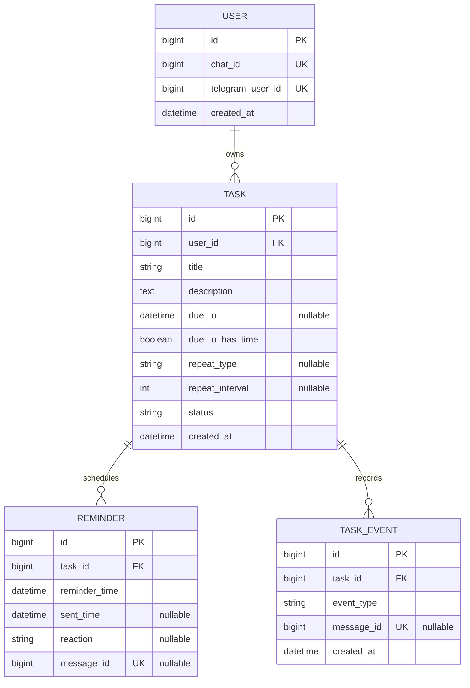
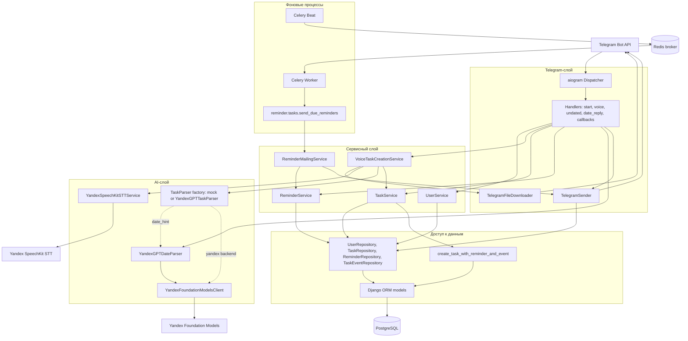
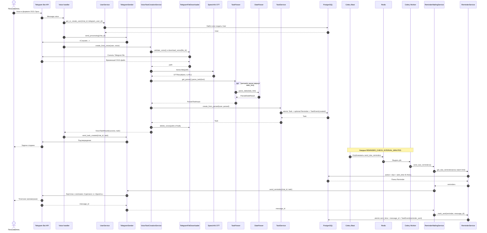

# Архитектурные артефакты проекта «Голосовой напоминальщик»

Документ фиксирует фактическую архитектуру MVP на 14 июля 2026 года. Он дополняет
[`ARCHITECTURE.md`](ARCHITECTURE.md), [`tables.md`](tables.md),
[`VOICE_PIPELINES.md`](VOICE_PIPELINES.md),
[`MAILING_PIPELINES.md`](MAILING_PIPELINES.md) и
[`use_cases.md`](use_cases.md). Диаграммы построены по текущим моделям и
сервисам, а не по планируемым follow-up задачам.

Исходники диаграмм для отдельного редактирования:

- [`diagrams/er-model.mmd`](diagrams/er-model.mmd);
- [`diagrams/service-architecture.mmd`](diagrams/service-architecture.mmd);
- [`diagrams/voice-reminder-sequence.mmd`](diagrams/voice-reminder-sequence.mmd).

## 1. ER-диаграмма



Ключевые правила модели:

- `User` владеет задачами; `Task`, `Reminder` и `TaskEvent` удаляются каскадно
  вслед за родительской записью.
- `Task.status` принимает `active`, `done`, `cancelled` или `deleted`.
- `Task.repeat_type` поддерживает `minutely`, `hourly`, `daily`, `weekly` и
  `monthly`; `repeat_interval` хранит шаг повторения.
- `due_to_has_time` отличает календарную дату от точного срока. `Reminder`
  создаётся только для будущего срока с явно указанным временем.
- `Reminder.sent_time` защищает уже доставленное напоминание от обычного
  повторного запуска фоновой job.
- Уникальный `TaskEvent.message_id` связывает Reply на карточку Telegram с одной
  задачей. `Reminder.message_id` используется для поиска отправленного
  напоминания при обработке кнопки «Сделано».
- В PostgreSQL есть индексы `Task(user, status)`, `Task(user, due_to)`,
  `Reminder(reminder_time)`, `Reminder(sent_time)`, `Reminder(task)` и
  `TaskEvent(task, created_at)`.

Источник: [`reminder/models.py`](../reminder/models.py) и репозитории в
[`reminder/repositories/`](../reminder/repositories/).

## 2. Схема сервисов



Границы ответственности:

- handlers и Celery task выполняют wiring и не содержат правил создания,
  переноса или завершения задачи;
- `VoiceTaskCreationService` управляет цепочкой download → STT → parser →
  `TaskService` и всегда удаляет временный OGG-файл;
- `TaskService` — единая точка бизнес-правил задачи и транзакций с
  `TaskEvent`;
- `ReminderMailingService` обрабатывает ограниченную пачку наступивших
  напоминаний и продолжает работу после ошибки одной записи;
- Redis хранит только очередь Celery. Пользователи, задачи, результаты доставки
  и аудит остаются в PostgreSQL;
- `TelegramSender` отвечает только за формат и отправку сообщений. Для due
  reminder событие `reminder_sent` создаёт `ReminderService.mark_sent`, чтобы
  `sent_time`, `message_id` и событие сохранялись вместе.

В коде уже есть форматирование карточек для digest/evening, но фоновые jobs
утреннего дайджеста и вечернего переноса не входят в реализованный BG-01 и на
диаграмме не показаны как работающие процессы.

## 3. Сценарий: голосовая задача и точечное напоминание



Если голос слишком длинный/большой, STT вернул пустой текст, parser вернул
ошибку или срок находится в прошлом, `VoiceTaskCreationService` возвращает
код ошибки, а `Task` не создаётся. Если точная дата отсутствует, создаётся
задача без `Reminder`.

Для due reminder действует MVP-ограничение: если Telegram уже принял сообщение,
а запись результата в PostgreSQL затем упала, следующий запуск может отправить
дубль. Claim/lock для параллельных workers и расширенная retry policy вынесены в
отдельные follow-up задачи.

## 4. Как пройти демонстрационный сценарий

Актуальный для этого снимка кода запуск использует Docker только для PostgreSQL
и Redis, а приложение запускается с хоста:

```bash
make install
cp .env.example .env
make up
python manage.py migrate
python manage.py runbot
make worker
make beat
```

`runbot`, worker и beat запускаются в отдельных терминалах. В `.env` нужно
задать собственные значения `DJANGO_SECRET_KEY`, `TELEGRAM_BOT_TOKEN`, а для
реального voice — `YANDEX_FOLDER_ID` и `YANDEX_API_KEY`. При
`PARSER_BACKEND=mock` YandexGPT не используется, но реальный voice всё равно
проходит через SpeechKit.

Проверка:

1. Отправить `/start`.
2. Отправить voice с одной задачей и точным будущим временем.
3. Убедиться, что пришло подтверждение создания.
4. Дождаться карточки напоминания (Beat проверяет due reminders раз в минуту).
5. Проверить в БД `Task(active)`, `Reminder.sent_time`,
   `Reminder.message_id`, `TaskEvent(created)` и
   `TaskEvent(reminder_sent, message_id)`.
6. Повторно запустить `send_due_reminders`: уже отправленный `Reminder` не
   должен породить второе сообщение.

Реальные токены и API-ключи нельзя добавлять в этот документ, README, тесты или
логи.

## 5. Карта синхронизации

| Артефакт | Источник истины в коде | Профильный документ |
| --- | --- | --- |
| ER-диаграмма | [`reminder/models.py`](../reminder/models.py), [`reminder/repositories/`](../reminder/repositories/) | [`tables.md`](tables.md) |
| Сервисная схема | [`reminder/services/`](../reminder/services/), [`reminder/bot/`](../reminder/bot/), [`reminder/tasks.py`](../reminder/tasks.py) | [`ARCHITECTURE.md`](ARCHITECTURE.md) |
| Voice creation | [`reminder/bot/handlers/voice.py`](../reminder/bot/handlers/voice.py), [`reminder/services/voice_tasks.py`](../reminder/services/voice_tasks.py) | [`VOICE_PIPELINES.md`](VOICE_PIPELINES.md), UC-02 |
| Due reminder | [`config/celery.py`](../config/celery.py), [`reminder/services/mailing.py`](../reminder/services/mailing.py), [`reminder/services/reminders.py`](../reminder/services/reminders.py) | [`MAILING_PIPELINES.md`](MAILING_PIPELINES.md), UC-09 |
| Команды и env | [`Makefile`](../Makefile), [`.env.example`](../.env.example), [`config/settings.py`](../config/settings.py) | [`README.md`](../README.md) |

При изменении моделей, внешних методов сервисов, event types, Celery schedule
или команд запуска этот документ и три `.mmd`-исходника нужно обновлять в том же
PR.
