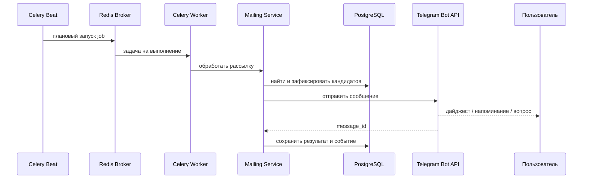
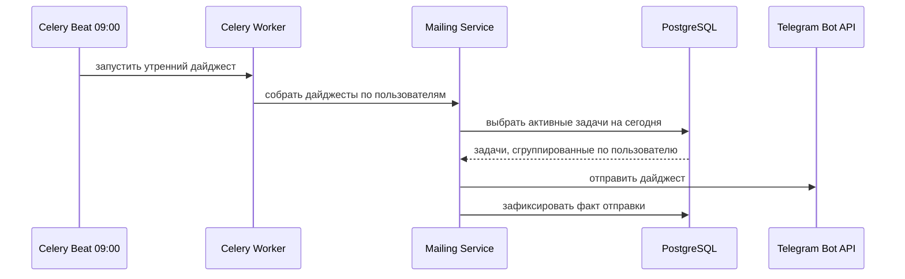
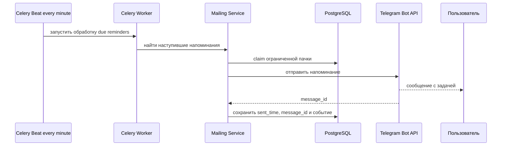
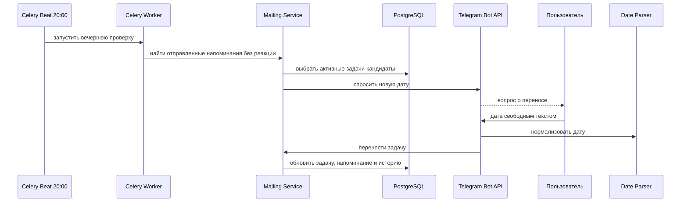

# Пайплайны рассылок MVP

Выбранный вариант: **Celery Beat -> Redis broker -> Celery worker -> PostgreSQL -> Telegram Bot API**.

Документ фиксирует целевую архитектуру фоновых рассылок для Telegram-бота. Он описывает, какие процессы должны быть в системе, какие данные считаются источником правды и какие бизнес-инварианты нельзя нарушать. Конкретные имена модулей, формат настроек, способ регистрации Celery-задач и детали ORM-запросов выбирает исполнитель в рамках Django/Celery/Redis/PostgreSQL стека.

Timezone MVP: **`DEFAULT_TIMEZONE`** в `config/settings.py` (по умолчанию `Europe/Moscow`).

Коротко о выбранной схеме: Telegram-бот принимает действия пользователя, PostgreSQL хранит состояние задач и напоминаний, Celery Beat по расписанию кладёт фоновые jobs в Redis, Celery worker забирает jobs из Redis и отправляет сообщения через Telegram Bot API. Redis в этой архитектуре — транспорт для фоновых jobs, а не место хранения пользовательских данных.

## Что фиксирует архитектура

Архитектура задаёт обязательные решения:

- PostgreSQL является источником истины для пользователей, задач, напоминаний, реакций, истории и технических статусов доставки.
- Redis используется как broker для Celery. Бизнес-состояние не должно жить только в Redis или памяти worker.
- Celery Beat является единственным планировщиком периодических запусков.
- Celery workers исполняют фоновые jobs и вызывают сервисы рассылок.
- Scheduled jobs должны быть идемпотентными: повторный запуск не должен создавать дубли сообщений и неверные статусы.
- После остановки или рестарта worker система должна восстановить состояние из PostgreSQL и обработать просроченные напоминания.
- Telegram `message_id` должен сохраняться для тех сообщений, по которым ожидается реакция пользователя.
- Ошибки внешних сервисов должны учитываться отдельно от бизнес-решений пользователя.

## Короткий словарь

| Термин | Простыми словами | Что важно для MVP |
| --- | --- | --- |
| Idempotency / идемпотентность | Повтор одного и того же действия не меняет результат второй раз | Если job запустилась дважды, пользователь не должен получить два одинаковых напоминания |
| Broker | Посредник между планировщиком и worker | Redis принимает jobs от Beat и отдаёт их worker, но не хранит бизнес-историю |
| Beat | Отдельный процесс-«будильник» Celery | В нужное время публикует jobs, сам не выбирает задачи и не отправляет Telegram-сообщения |
| Worker | Процесс-исполнитель | Забирает job, читает PostgreSQL, вызывает сервис рассылки и фиксирует результат |
| Queue / очередь | Именованный поток jobs внутри broker | Позволяет отделить частые напоминания от массовых рассылок |
| Retry / ретрай | Повтор попытки после временной ошибки | Нужен для timeout/5xx, но не для случаев «пользователь заблокировал бота» |
| Rate limit | Ограничение частоты запросов внешнего API | Telegram может попросить подождать через `retry_after`; массовые отправки должны идти пачками |
| Dead letter / ручной разбор | Место или статус для задач, которые автоматически больше не повторяем | После нескольких неудач запись должна быть видна в логах/БД для анализа, а не крутиться бесконечно |
| Timezone | Правило перевода «сегодня», `MORNING_DIGEST_HOUR` и `EVENING_MISSED_CHECK_HOUR` в конкретное время | В MVP все расчёты идут в `DEFAULT_TIMEZONE` (`Europe/Moscow`), даже если пользователь физически в другом регионе |
| Статус доставки | Техническое состояние попытки отправить сообщение | Отличается от статуса задачи: задача может быть `active`, а доставка напоминания временно `failed` |

## Что остается на реализацию стажёру

Исполнитель должен самостоятельно выбрать конкретный способ реализации внутри выбранного стека:

- структуру Celery application и регистрацию задач;
- способ чтения `.env` в `config/settings.py` (секреты и override для dev/prod);
- способ запуска процессов в dev/prod окружении;
- точные ORM-запросы, транзакции и блокировки;
- текст сообщений пользователю и форматирование списков;
- реализацию retry policy, rate limit и логирования;
- тестовую стратегию для сервисов, Celery-задач и обработчиков реакций.

При этом исполнитель не должен менять зафиксированную архитектурную роль компонентов: PostgreSQL хранит состояние, Redis передаёт jobs, Beat планирует, workers исполняют.

## Роли компонентов

| Компонент | Роль | Важные ограничения |
| --- | --- | --- |
| PostgreSQL | Хранит пользователей, задачи, напоминания, реакции, события и технические статусы | Единственный источник правды для бизнес-состояния |
| Redis | Broker Celery | Не хранит бизнес-историю и не заменяет таблицы БД |
| Celery Beat | Публикует периодические jobs по расписанию | Для MVP нужен один активный экземпляр |
| Celery Worker | Выполняет jobs рассылок | Должен безопасно переживать повторы и падения |
| Mailing Service | Содержит бизнес-логику выбора кандидатов и фиксации результата | Не должен обходить правила доступа и статусы задач |
| Telegram Bot API | Доставляет сообщения пользователю | Ошибки и rate limit обрабатываются явно |

## Границы ответственности

| Часть системы | Делает | Не делает |
| --- | --- | --- |
| Telegram bot / API handler | Принимает команды, реакции и ответы пользователя; вызывает сервисы; отправляет быстрые ответы | Не сканирует всю базу по расписанию и не хранит состояние диалога только в памяти процесса |
| Celery Beat | Публикует jobs по расписанию: утро, поминутные напоминания, вечерняя проверка | Не выбирает конкретных пользователей и не вызывает Telegram напрямую |
| Celery Worker | Исполняет job, открывает транзакции, вызывает `Mailing Service`, обрабатывает retry | Не принимает пользовательские updates из Telegram |
| Mailing Service | Решает, кого и что отправлять; проверяет статусы; фиксирует результат в PostgreSQL | Не зависит от конкретного способа запуска: handler и worker должны использовать одну бизнес-логику |
| PostgreSQL | Хранит пользователей, задачи, напоминания, события, технические статусы и ключи идемпотентности | Не должен заменяться Redis для данных, которые нужны после рестарта |
| Redis | Передаёт jobs между Beat и workers | Не хранит задачи пользователей, `message_id`, историю доставок, реакции или единственную копию состояния диалога |

Практическое правило: если потеря данных после перезапуска Redis или worker ломает пользовательский сценарий, эти данные должны быть в PostgreSQL.

## Расписания MVP

Расписания Celery Beat задаются в `config/settings.py` и регистрируются в `config/celery.py`. Значения по умолчанию:

| Job | Константа в `settings.py` | Расписание по умолчанию | Что делает | Связанные UC |
| --- | --- | --- | --- | --- |
| Утренний дайджест | `MORNING_DIGEST_HOUR` | каждый день в **09:00 MSK** | отправляет пользователю список активных задач на сегодня | UC-06 |
| Точечные напоминания | `REMINDER_CHECK_INTERVAL_MINUTES` | примерно каждые **1 мин** | отправляет due reminders, время которых наступило | UC-07 |
| Вечерняя проверка | `EVENING_MISSED_CHECK_HOUR` | каждый день в **20:00 MSK** | спрашивает о переносе задач, по которым не было реакции | UC-10 |
| Cleanup зависших диалогов | `STALE_DIALOG_CLEANUP_INTERVAL_MINUTES` | опционально, периодически | закрывает старые состояния ожидания даты | UC-04, UC-10 |

Поминутные напоминания не гарантируют точность до секунды. Допустимое опоздание складывается из `REMINDER_CHECK_INTERVAL_MINUTES`, времени выполнения worker и задержек Telegram API.

Пример: если job запускается каждые `REMINDER_CHECK_INTERVAL_MINUTES` минут (по умолчанию 1), а напоминание назначено на 12:00:15, нормальная отправка может случиться в 12:01. Это не ошибка MVP, если сообщение не потеряно и не продублировано.

## Очереди и workers

Для MVP допустим один worker, который слушает все очереди рассылок. Архитектура должна позволять позже разделить нагрузку без переписывания бизнес-логики.

Рекомендуемые очереди:

| Queue | Тип задач | Назначение |
| --- | --- | --- |
| `reminders` | поминутные напоминания | частый job, чувствительный к дублям |
| `mailing` | утренний дайджест и вечерняя проверка | плановые массовые рассылки |
| `default` | технические follow-up задачи | запасная очередь для неосновных jobs |

Разделение очередей нужно для управления нагрузкой и rate limit. Например, напоминания могут запускаться часто и небольшими пачками, а массовые рассылки должны идти осторожно, чтобы не упереться в ограничения Telegram.

## Источники данных

Минимальные сущности берутся из `tz/tables.md`:

- `User(id, chat_id)` — получатель сообщений.
- `Task(title, description, due_to, repeat_type, repeat_interval, status, created_at, uid)` — задача пользователя.
- `Reminder(reminder_time, sent_time, reaction, message_id, task_id)` — конкретное напоминание и связь с Telegram-сообщением.
- `TaskEvent(task_id, event_type, created_at)` — история жизненного цикла задачи.

Общие правила выборок:

- все рассылки работают только в рамках владельца задачи через `Task.uid`;
- в плановые рассылки попадают только задачи со статусом `active`;
- задачи `done`, `cancelled`, `deleted` не должны получать будущие напоминания;
- задачи без даты не получают точечные напоминания, пока пользователь не назначит дату;
- утренний дайджест использует тот же смысл фильтра «задачи на сегодня», что и команда `/today`;
- вечерняя проверка рассматривает только отправленные напоминания без финальной реакции.

## Формат сообщений

Сообщения должны быть короткими и понятными для Telegram.

Общие требования:

- не отправлять пустой плановый дайджест;
- показывать пользователю только его задачи;
- сохранять `message_id` для напоминаний и вечерних вопросов, если по ним ожидается реакция или продолжение диалога;
- не включать в логи полный приватный текст задачи, если для отладки достаточно идентификаторов;
- при длинных списках использовать ограничение из use cases: не больше **5 задач на страницу**.

Точные тексты сообщений, кнопки и форматирование выбирает исполнитель, но они должны поддерживать сценарии из `tz/use_cases.md`.

## Утренний дайджест

Бизнес-правила:

- запуск выполняется каждый день в **`MORNING_DIGEST_HOUR`:00 MSK** (по умолчанию 09:00);
- в список входят только активные задачи текущего дня;
- если у пользователя нет задач на сегодня, сообщение не отправляется;
- пользователь не должен видеть задачи другого `chat_id`;
- повторный запуск за тот же день не должен отправлять пользователю второй одинаковый дайджест;
- реакция на дайджест не меняет статус задачи, если это отдельно не реализовано в пользовательском сценарии.

Для аудита можно фиксировать событие отправки дайджеста в `TaskEvent` или отдельной таблице доставок. Конкретную модель хранения выбирает исполнитель.

## Поминутные напоминания

Источник для отправки — `Reminder`, а не прямое сканирование всех задач по `Task.due_to`. При создании или переносе задачи система должна создать актуальное будущее напоминание. При выполнении, отмене, удалении или переносе старые будущие напоминания должны быть отменены, заменены или исключены из обработки.

Кандидат на отправку должен соответствовать условиям:

- время напоминания наступило или уже прошло;
- напоминание ещё не было успешно отправлено;
- связанная задача активна;
- задача принадлежит существующему пользователю;
- если введены технические статусы, напоминание находится в состоянии, допускающем обработку или retry.

Обработка должна идти ограниченными пачками. Если просроченных напоминаний много, система может отправить часть сейчас и продолжить на следующем запуске. Просроченное напоминание лучше доставить позже, чем потерять.

Пример штатного потока:

1. Пользователь создал задачу «позвонить врачу завтра в 15:00».
2. Система сохранила `Task(active)` и будущий `Reminder(reminder_time=15:00)`.
3. После 15:00 поминутный job нашёл reminder, зафиксировал claim, отправил Telegram-сообщение и сохранил `sent_time` + `message_id`.
4. Если пользователь поставит ✅ или ❌, обработчик реакции найдёт reminder по `chat_id` + `message_id` и изменит статус задачи.

## Вечерняя проверка и перенос

Бизнес-правила:

- запуск выполняется каждый день в **`EVENING_MISSED_CHECK_HOUR`:00 MSK** (по умолчанию 20:00);
- если переносить нечего, сообщение не отправляется;
- рассматриваются только активные задачи;
- задачи с финальной реакцией ✅ или ❌ не попадают в вечерний вопрос;
- пользователь вводит новую дату свободным русским текстом;
- дату в прошлом нужно отклонить и попросить указать будущую дату;
- если пользователь не отвечает на вопрос о переносе, для MVP задача остается активной, если другое поведение не зафиксировано отдельно.

После успешного переноса система должна:

- обновить `Task.due_to`;
- отменить, заменить или исключить старые будущие `Reminder` по задаче;
- создать новое актуальное напоминание;
- создать событие переноса в `TaskEvent`;
- отправить пользователю подтверждение.

## Реакции пользователя

Реакции приходят не из scheduled jobs, но замыкают цикл рассылок.

Правила обработки:

- реакция связывается с задачей через сохранённый `message_id` и `chat_id`;
- неизвестные или устаревшие `message_id` игнорируются или логируются;
- учитывается только первая финальная реакция;
- ✅ переводит задачу в `done`;
- ❌ переводит задачу в `cancelled`;
- после финальной реакции будущие напоминания по задаче больше не должны отправляться;
- повторная или изменённая реакция не должна ломать историю и статусы.

## Идемпотентность и claim

Celery отвечает за доставку jobs в worker, но не гарантирует бизнес-идемпотентность. Все гарантии против дублей должны опираться на PostgreSQL.

Важно различать два уровня. Celery может повторно доставить одну и ту же job, а Beat может опубликовать следующий запуск, пока предыдущий ещё работает. Для бизнеса это не должно быть заметно: перед отправкой нужно проверить в БД, что конкретная рассылка ещё не была успешно обработана.

Рекомендуемые ключи идемпотентности:

| Сценарий | Ключ | Правило |
| --- | --- | --- |
| Утренний дайджест | пользователь + дата + тип рассылки | не отправлять один и тот же дайджест дважды за день |
| Точечное напоминание | `reminder_id` | если напоминание уже отправлено, не отправлять повторно |
| Вечерний вопрос | напоминание или задача + дата + тип вопроса | не задавать один и тот же вопрос несколько раз |
| Реакция | напоминание или `message_id` | учитывать только первую финальную реакцию |

Claim кандидатов должен предотвращать параллельную обработку одного и того же напоминания несколькими workers. Конкретный механизм может быть основан на транзакциях, блокировках строк, технических статусах или отдельной таблице доставок. Выбранный способ должен быть покрыт тестами.

Возможная проблема MVP: worker отправил сообщение в Telegram, но упал до записи результата в БД. Полностью исключить дубль сложно, поэтому реализация должна хотя бы снижать риск через статусы обработки, аудит событий и повторную проверку состояния перед отправкой.

## Статусы доставки

Минимальная схема `Reminder` позволяет вывести часть статусов из имеющихся полей:

| Логический статус | Смысл |
| --- | --- |
| `pending` | напоминание ещё не наступило или не обработано |
| `due` | время наступило, отправка ещё не зафиксирована |
| `sent` | сообщение отправлено, `sent_time` и `message_id` сохранены |
| `reacted_done` | пользователь поставил ✅ |
| `reacted_cancelled` | пользователь поставил ❌ |
| `failed` | отправка завершилась ошибкой и требует решения |
| `cancelled` | напоминание больше не актуально из-за статуса или переноса задачи |

Для более надёжной реализации можно расширить модель техническими полями или отдельной сущностью доставки. Такое расширение допустимо, если оно не ломает базовые сущности из `tz/tables.md` и упрощает retry, аудит и идемпотентность.

## Ошибки и ретраи

| Ситуация | Требуемое поведение |
| --- | --- |
| Telegram timeout или 5xx | выполнить ограниченный retry с backoff |
| Telegram 429 | учитывать `retry_after` и снижать темп отправки |
| Пользователь заблокировал бота | не ретраить бесконечно, будущие отправки можно пропускать или помечать как невозможные |
| Задача изменила статус между claim и отправкой | повторно проверить актуальность и не отправлять сообщение по неактивной задаче |
| Worker упал во время обработки | следующий запуск должен восстановить состояние из БД |
| БД недоступна | не отправлять сообщение, если результат нельзя будет зафиксировать |
| Некорректная конфигурация или Telegram token | быстро вывести ошибку в логи, не маскировать бесконечными ретраями |

Ретраи должны применяться только к временным ошибкам. Постоянные ошибки нужно фиксировать так, чтобы они не создавали бесконечный цикл повторов.

Типовые сценарии сбоев:

| Сценарий | Ожидаемое поведение |
| --- | --- |
| Telegram временно недоступен | delivery остаётся неуспешной или ожидающей retry; система повторяет ограниченное число попыток и пишет понятный лог |
| Пользователь заблокировал бота | future reminders для этого `chat_id` не должны бесконечно ретраиться; допустимо пометить отправку как постоянную ошибку |
| Worker перезапущен во время обработки | после старта новый worker читает PostgreSQL и продолжает с неотправленных или спорных записей |
| Одна и та же job попала в очередь дважды | второй запуск видит в PostgreSQL, что сообщение уже отправлено или находится в обработке, и не шлёт дубль |
| Reminder был изменён или отменён между claim и отправкой | worker повторно проверяет актуальность задачи перед вызовом Telegram |
| Ошибка попала в dead letter / ручной разбор | запись больше не повторяется автоматически без конца; по логам и статусу понятно, какой reminder требует решения |

Для учебного проекта достаточно логов, счётчика попыток и понятного статуса в БД. Отдельную промышленную dead-letter queue можно оставить как follow-up, если она не требуется стеком.

## Ограничения по частоте

MVP должен учитывать ограничения Telegram и размер базы:

- отправлять сообщения ограниченными пачками;
- не держать одну транзакцию на весь список пользователей;
- не отправлять пустые плановые сообщения;
- не запускать одинаковые jobs параллельно без защиты от дублей;
- уважать Telegram rate limit и `retry_after`;
- иметь возможность уменьшить batch size без изменения бизнес-логики.

Для маленького учебного проекта достаточно консервативных лимитов и понятного логирования. Если пользователей станет много, понадобятся отдельные worker pools, более строгий backpressure и метрики очередей.

## Хранение истории

`TaskEvent` фиксирует значимые события жизненного цикла:

- создание задачи;
- отправка точечного напоминания;
- опционально отправка утреннего дайджеста;
- выполнение по реакции ✅;
- отмена по реакции ❌;
- перенос даты;
- назначение даты задаче без даты;
- удаление задачи через кнопку.

История нужна для:

- восстановления цепочки «создали задачу -> отправили напоминание -> получили реакцию»;
- статистики за неделю;
- отладки дублей и пропущенных отправок;
- объяснения пользователю, почему задача больше не напоминается.

Если одной таблицы `TaskEvent` недостаточно для аудита доставок, исполнитель может добавить отдельную таблицу или технические поля. Важно, чтобы история не зависела от Redis и не терялась после рестарта процессов.

## Наблюдаемость

Минимум для MVP:

- структурные логи в stdout для каждого scheduled job;
- в логах должны быть идентификаторы job, пользователя, задачи, напоминания, сообщения и попытки;
- не логировать Telegram token, API keys и приватные тексты без необходимости;
- фиксировать счётчики: сколько кандидатов найдено, отправлено, пропущено и завершилось ошибкой;
- отдельно различать временные ошибки, постоянные ошибки и бизнес-пропуски;
- иметь тесты на фильтры, идемпотентность и реакции.

Инструменты мониторинга Celery можно добавить как follow-up. Для MVP достаточно логов и воспроизводимых тестов.

## Вопросы проектирования для исполнителя

Эти решения полезно продумать самостоятельно, но они не должны менять базовую архитектуру:

- Где удобнее хранить технический статус доставки: расширить `Reminder` или добавить отдельную сущность delivery?
- Какой минимальный набор уникальных ограничений нужен, чтобы не отправлять дайджест/вечерний вопрос дважды?
- Какой batch size выбрать для учебной базы и как быстро его уменьшить при ошибках Telegram?
- Какие ошибки считать временными, а какие постоянными?
- Что именно писать в `TaskEvent`, а что оставлять только в технических логах?
- Как проверить идемпотентность без реального Telegram API: через мок, fake service или тестовую обёртку?

Не нужно отдавать на самостоятельный выбор роли PostgreSQL, Redis, Beat и worker: эти границы зафиксированы выше.

## Основные use cases

| UC | Пайплайн | Ключевое правило |
| --- | --- | --- |
| UC-06 | утренний дайджест | ежедневно в `MORNING_DIGEST_HOUR` (09:00), только активные задачи на сегодня |
| UC-07 | поминутные напоминания | наступивший `Reminder` отправляется один раз и сохраняет `message_id` |
| UC-08 | реакция ✅ | первая реакция делает задачу `done` |
| UC-09 | реакция ❌ | первая реакция отменяет задачу |
| UC-10 | вечерний перенос | в `EVENING_MISSED_CHECK_HOUR` (20:00) спросить новую дату для отправленных напоминаний без реакции |
| UC-F03 | повторения | полный recurrence-cycle можно вынести в follow-up |
| UC-F04 | статистика | считать по `TaskEvent` за последние 7 дней |

## Минимальные тесты

Набор тестов должен подтверждать бизнес-инварианты, а не конкретную внутреннюю структуру кода.

- Утренний дайджест отправляет задачи на сегодня, не отправляет пустое сообщение, фильтрует по пользователю и не дублируется при повторном запуске.
- Поминутные напоминания выбирают только наступившие активные reminders, сохраняют результат отправки и не отправляют `done`, `cancelled`, `deleted`.
- Вечерняя проверка выбирает только отправленные reminders без реакции и не пишет пользователю при пустом списке.
- Реакции ✅ и ❌ применяются только один раз и отменяют будущие напоминания.
- Retry policy повторяет временные ошибки и не зацикливается на постоянных ошибках.
- Идемпотентность сохраняется при повторном запуске job с тем же временем и при параллельной обработке одной пачки.

## Учебные acceptance criteria

К концу реализации стажёр должен уметь показать работу системы руками и тестами:

- У пользователя с задачей на сегодня в 09:00 появляется утренний дайджест; у пользователя без задач сообщение не отправляется.
- Напоминание с наступившим `reminder_time` отправляется один раз, сохраняет `sent_time` и `message_id`.
- Повторный запуск той же фоновой job не создаёт дубль сообщения для уже отправленного reminder.
- Реакция ✅ переводит задачу в `done`, реакция ❌ — в `cancelled`; повторная реакция не меняет финальный статус.
- После выполнения, отмены, удаления или переноса старые будущие напоминания не отправляются.
- Вечером пользователь получает вопрос только по активным отправленным напоминаниям без реакции.
- Если Telegram временно возвращает ошибку, система делает ограниченный retry и оставляет диагностируемый статус.
- Если пользователь заблокировал бота, система не пытается отправлять одно и то же сообщение бесконечно.
- После перезапуска worker просроченное, но не обработанное напоминание можно доставить позже.
- Все списки и рассылки строго фильтруются по текущему `chat_id`.

Ручная проверка MVP может идти как сценарий: создать задачу на ближайшее время, дождаться напоминания, поставить ✅, убедиться, что вечерний перенос по этой задаче уже не приходит; затем повторить для ❌, переноса и пользователя без задач.
