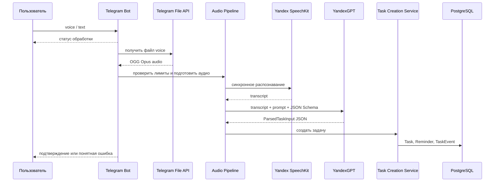

# Голосовой пайплайн MVP

Выбранная архитектура: **Telegram voice -> скачивание аудио -> синхронный Yandex SpeechKit STT -> синхронный YandexGPT / Foundation Models -> создание задачи в приложении**.

Документ фиксирует целевую архитектуру обработки голосовых и текстовых сообщений для создания задач. Он описывает обязательные компоненты, контракты данных, правила вызова Yandex Cloud, обработку ошибок и критерии готовности. Исполнитель реализует ровно этот поток внутри Telegram-бота и не добавляет локальные LLM, Ollama, очереди, фоновые workers или альтернативных провайдеров AI в MVP.

Timezone MVP: **`DEFAULT_TIMEZONE`** в `config/settings.py` (по умолчанию `Europe/Moscow`).



Для текстового сообщения пайплайн начинается со шага YandexGPT parser: STT, скачивание и подготовка аудио не выполняются.

## Что фиксирует архитектура

Архитектура задаёт обязательные решения:

- Telegram Bot принимает `voice` и обычный текст как два входа в один сценарий создания задачи.
- Telegram voice скачивается через Telegram File API и обрабатывается как короткий OGG Opus файл.
- Speech-to-text выполняется только через синхронный Yandex SpeechKit STT.
- Семантический разбор задачи выполняется только через YandexGPT / Foundation Models.
- YandexGPT получает system prompt, текущую дату, timezone, JSON Schema, описания полей и примеры.
- PostgreSQL является источником истины для созданных `Task`, `Reminder` и `TaskEvent`.
- `TaskCreationService` создаёт задачу по единому контракту для текста и voice.
- Redis, Celery, локальные модели, Ollama и фоновые AI jobs не входят в MVP голосового пайплайна.
- Ошибки внешних API не должны создавать частично сохранённые задачи.
- Пользователь всегда получает либо подтверждение создания задачи, либо понятную причину отказа.

## Роли компонентов

| Компонент | Роль | Важные ограничения |
| --- | --- | --- |
| Telegram Bot Handler | Принимает сообщение, отвечает пользователю, вызывает пайплайн | Не содержит бизнес-логику создания задачи |
| Telegram File API | Отдаёт файл голосового сообщения | Используется только для `voice` |
| Audio Pipeline | Проверяет длительность, размер, формат и временный файл | Удаляет временный файл после обработки |
| Yandex SpeechKit STT | Превращает OGG Opus в русский текст | Синхронный endpoint, короткие аудио |
| YandexGPT Parser | Извлекает структуру задачи из текста | Возвращает только JSON по схеме |
| Task Creation Service | Создаёт `Task`, `Reminder`, `TaskEvent` | Единственная точка записи бизнес-сущностей |
| PostgreSQL | Хранит задачи, напоминания и историю | Единственный источник правды |

## Источники данных

Минимальные сущности берутся из `tz/tables.md`:

- `User(id, chat_id)` — владелец задачи.
- `Task(title, description, due_to, due_to_has_time, repeat_type, repeat_interval, status, created_at, uid)` — созданная задача.
- `Reminder(reminder_time, sent_time, reaction, message_id, task_id)` — будущее точечное напоминание.
- `TaskEvent(task_id, event_type, created_at)` — событие создания задачи.

Общие правила:

- задача всегда создаётся для пользователя, чей `chat_id` пришёл в Telegram update;
- `status` новой задачи всегда равен `active`;
- `Task.uid` обязательно указывает на текущего пользователя;
- `Reminder` создаётся только для задачи с конкретным будущим `due_to`, где известны дата и время;
- задача без даты создаётся без `Reminder`;
- задача с датой без точного времени создаётся без точечного `Reminder`;
- `TaskEvent` с событием создания фиксируется после успешной записи задачи.

## Контракты данных

Минимальные внутренние DTO:

```python
@dataclass
class STTResult:
    text: str
    language: str | None = "ru-RU"
    provider: str = "yandex_speechkit"


@dataclass
class ParsedTaskInput:
    title: str
    description: str | None
    due_to: datetime | None
    due_to_has_time: bool
    repeat_type: str | None
    repeat_interval: int | None
    raw_text: str


@dataclass
class ParsedDateResult:
    due_to: datetime
    due_to_has_time: bool
```

Правила полей:

| Поле | Правило |
| --- | --- |
| `title` | Обязательное короткое название из главного действия пользователя |
| `description` | Детали из исходного текста или `null` |
| `due_to` | Дата и время в timezone `Europe/Moscow` или `null` |
| `due_to_has_time` | `true`, если пользователь явно указал точное время, включая `00:00`; иначе `false` |
| `repeat_type` | `daily`, `weekly`, `monthly` или `null` |
| `repeat_interval` | Целое число от `1`, если есть повторение, иначе `null` |
| `raw_text` | Распознанный или исходный пользовательский текст |

`priority` в MVP не сохраняется в `Task`, поэтому parser не возвращает это поле.

## Конфигурация

Все параметры голосового и текстового пайплайна задаются в **`config/settings.py`**. Секреты (`YANDEX_API_KEY`, `TELEGRAM_BOT_TOKEN`) читаются из `.env` при старте Django; tunable-константы имеют значения по умолчанию прямо в settings.

Основные константы (tunable — значения по умолчанию в `settings.py`):

| Константа в `settings.py` | Назначение | Значение по умолчанию |
| --- | --- | --- |
| `STT_PROVIDER` | Провайдер распознавания речи | `yandex_speechkit` |
| `TASK_PARSER` | Провайдер разбора текста | `yandex_gpt` |
| `YANDEX_STT_LANGUAGE` | Язык STT | `ru-RU` |
| `YANDEX_STT_FORMAT` | Формат аудио для STT | `oggopus` |
| `YANDEX_STT_TIMEOUT_SEC` | Таймаут STT-запроса | `30` |
| `VOICE_MAX_DURATION_SEC` | Максимальная длительность voice | `25` |
| `VOICE_MAX_SIZE_BYTES` | Максимальный размер voice-файла | `1_000_000` |
| `YANDEX_GPT_MODEL` | Модель YandexGPT | `yandexgpt-lite` |
| `YANDEX_GPT_TEMPERATURE` | Temperature парсера | `0.1` |
| `YANDEX_GPT_MAX_TOKENS` | Лимит токенов ответа | `1000` |
| `YANDEX_GPT_TIMEOUT_SEC` | Таймаут GPT-запроса | `30` |
| `DEFAULT_TIMEZONE` | Часовой пояс MVP | `Europe/Moscow` |

Секреты (`YANDEX_API_KEY`, `YANDEX_FOLDER_ID`, `TELEGRAM_BOT_TOKEN`) хранятся в `.env` и при старте попадают в одноимённые поля `settings.py` — в коде используются только через Django settings.

Для сервисного аккаунта в Yandex Cloud нужны роли:

- `ai.speechkit-stt.user`;
- `ai.languageModels.user`.

Авторизация выполняется заголовком `Authorization: Api-Key <YANDEX_API_KEY>`. Значение `YANDEX_API_KEY` нельзя выводить в логи, сообщения пользователю и тестовые snapshots.

## Telegram voice input

Handler для `voice` выполняет шаги строго в таком порядке:

1. Найти пользователя по `chat_id` или создать пользователя по правилам основного Telegram-бота.
2. Проверить `message.voice.duration <= VOICE_MAX_DURATION_SEC`.
3. Ответить пользователю коротким статусом обработки.
4. Скачать файл через Telegram File API по `file_id`.
5. Проверить размер файла `<= VOICE_MAX_SIZE_BYTES`.
6. Передать файл в `YandexSpeechKitSTTService`.
7. Передать transcript в `YandexGPTTaskParser`.
8. Передать `ParsedTaskInput` в `TaskCreationService`.
9. Удалить временный аудиофайл.
10. Отправить пользователю подтверждение с названием задачи и датой, если дата распознана.

Если проверка длительности или размера не проходит, SpeechKit и YandexGPT не вызываются.

## Text input

Handler для текстового сообщения использует тот же parser и тот же сервис создания:

1. Найти пользователя по `chat_id` или создать пользователя по правилам основного Telegram-бота.
2. Передать текст сообщения в `YandexGPTTaskParser`.
3. Передать `ParsedTaskInput` в `TaskCreationService`.
4. Отправить пользователю подтверждение или ошибку.

Текстовый сценарий не должен иметь отдельную бизнес-логику создания задачи. Различается только источник `raw_text`.

## SpeechKit STT

Endpoint: `POST https://stt.api.cloud.yandex.net/speech/v1/stt:recognize`.

Параметры запроса:

| Параметр | Значение |
| --- | --- |
| `folderId` | `YANDEX_FOLDER_ID` |
| `lang` | `ru-RU` |
| `format` | `oggopus` |
| Body | bytes скачанного Telegram voice файла |
| Timeout | `YANDEX_STT_TIMEOUT_SEC` |

Правила STT:

- входной формат для MVP — OGG Opus из Telegram voice;
- перекодирование выполняется только если скачанный файл не принимается синхронным SpeechKit endpoint;
- пустой `result` считается ошибкой распознавания;
- transcript очищается от пробелов по краям;
- transcript сохраняется в `ParsedTaskInput.raw_text`;
- длинные аудио отклоняются сообщением пользователю, async STT в MVP не реализуется.

## YandexGPT parser

Endpoint: `POST https://llm.api.cloud.yandex.net/foundationModels/v1/completion`.

Model URI: `gpt://<YANDEX_FOLDER_ID>/<YANDEX_GPT_MODEL>`.

Parser обязан отправлять в YandexGPT:

- `modelUri`;
- `completionOptions.stream=false`;
- `completionOptions.temperature=YANDEX_GPT_TEMPERATURE`;
- `completionOptions.maxTokens=YANDEX_GPT_MAX_TOKENS`;
- system prompt на русском языке;
- текущую дату и время в `Europe/Moscow`;
- пользовательский текст;
- JSON Schema ответа.

Разбор полной задачи выполняется в два шага:

```text
transcript
  -> TaskSemanticParser: title, description, date_hint, repeat fields
  -> YandexGPTDateParser.parse_date(date_hint), если date_hint != null
  -> ParsedTaskInput
```

Task system prompt должен требовать:

- извлечь одну задачу из русского текста;
- вернуть только JSON без Markdown и пояснений;
- не придумывать отсутствующие факты;
- возвращать `null` для отсутствующих `date_hint`, описания и повторения;
- возвращать `date_hint` как дословную подстроку исходного текста;
- не вычислять datetime на semantic-шаге;
- отклонять текст, из которого нельзя получить название задачи.

Если `date_hint` заполнен, он передаётся в тот же `YandexGPTDateParser`,
который используется для Reply при назначении и переносе. Оба prompt-а
получают одинаковый динамический календарь от текущего времени в
`Europe/Moscow`. Если в `date_hint` назван день недели, итоговый weekday
проверяется приложением.

## JSON Schema

Ответ semantic-шага валидируется по схеме:

```json
{
  "type": "object",
  "properties": {
    "title": {
      "type": "string",
      "minLength": 1,
      "description": "Короткое название задачи из главного действия пользователя"
    },
    "description": {
      "type": ["string", "null"],
      "description": "Детали и контекст из исходного текста, без выдуманных фактов"
    },
    "date_hint": {
      "type": ["string", "null"],
      "description": "Дословная подстрока с датой или временем из исходного текста"
    },
    "repeat_type": {
      "type": ["string", "null"],
      "enum": ["daily", "weekly", "monthly", null],
      "description": "Тип повторения, если пользователь явно задал повторение"
    },
    "repeat_interval": {
      "type": ["integer", "null"],
      "minimum": 1,
      "description": "Интервал повторения; null без повторения"
    }
  },
  "required": ["title", "description", "date_hint", "repeat_type", "repeat_interval"],
  "additionalProperties": false
}
```

Примеры для prompt:

| Вход | JSON |
| --- | --- |
| `Отправить отчёт сегодня до 18, добавить цифры продаж` | `{"title":"Отправить отчёт","description":"Добавить цифры продаж","date_hint":"сегодня до 18","repeat_type":null,"repeat_interval":null}` |
| `В пятницу позвонить врачу` | `{"title":"Позвонить врачу","description":null,"date_hint":"В пятницу","repeat_type":null,"repeat_interval":null}` |
| `Купить корм для кота` | `{"title":"Купить корм для кота","description":null,"date_hint":null,"repeat_type":null,"repeat_interval":null}` |
| `Каждый понедельник в 9 проверить финансы` | `{"title":"Проверить финансы","description":null,"date_hint":"Каждый понедельник в 9","repeat_type":"weekly","repeat_interval":1}` |

Date-шаг возвращает `due_to` и `due_to_has_time` по отдельной схеме
`DATE_GENERATION_JSON_SCHEMA`. Ошибки любого шага (`parser_failed`,
`date_in_past`) пробрасываются без создания задачи. Если semantic API не
вернул валидный JSON по схеме, задача не создаётся.

## Правила маппинга

| Результат parser | Действие |
| --- | --- |
| Валидный `title` | Использовать как `Task.title` |
| `description=null` | Сохранить пустую строку в `Task.description` |
| `due_to=null` | Создать задачу без даты и без `Reminder` |
| `due_to_has_time=true`, точный срок в будущем | Создать задачу и один будущий `Reminder` |
| `due_to_has_time=false`, дата сегодня или в будущем | Создать задачу без точечного `Reminder` |
| Прошедшая календарная дата либо точный срок `<= now` | Не создавать задачу, попросить пользователя указать будущую дату |
| `repeat_type=null` | Создать обычную задачу без повторения |
| `repeat_type` заполнен | Сохранить `repeat_type` и `repeat_interval` в `Task` |
| Пустой `title` | Не создавать задачу, попросить сформулировать задачу понятнее |

Все даты нормализуются в timezone `Europe/Moscow` до записи в БД.

## Создание задачи

`TaskCreationService` является единственной точкой записи бизнес-сущностей.

Сервис выполняет шаги:

1. Проверить, что `ParsedTaskInput.title` не пустой.
2. Для даты без времени разрешить сегодня и будущие дни; точный datetime потребовать строго в будущем.
3. Создать `Task` со статусом `active` и владельцем `user`.
4. Создать `Reminder`, только если `due_to_has_time=true` и точный срок находится в будущем.
5. Создать `TaskEvent` с событием создания.
6. Вернуть созданную задачу в handler.

Запись `Task`, `Reminder` и `TaskEvent` выполняется в одной транзакции. Если создание любой сущности завершилось ошибкой, частично созданные данные не остаются в БД.

## Ответы пользователю

Сообщения должны быть короткими и понятными для Telegram.

| Ситуация | Ответ |
| --- | --- |
| Началась обработка voice | `Распознаю голосовое...` |
| Задача создана без даты | `Создал задачу: <title>` |
| Задача создана с датой | `Создал задачу: <title>. Напомню: <date>` |
| Voice длиннее лимита | `Слишком длинное голосовое. Отправьте короче или текстом.` |
| Файл слишком большой | `Файл слишком большой. Отправьте короткое голосовое или текст.` |
| Пустой transcript | `Не расслышал задачу. Повторите голосом или отправьте текстом.` |
| Невалидный JSON или пустой title | `Не понял задачу. Сформулируйте проще.` |
| Дата в прошлом | `Указана прошедшая дата. Напишите будущую дату.` |
| Yandex API недоступен | `Сервис распознавания временно недоступен. Отправьте текстом.` |
| Ошибка конфигурации | `Техническая ошибка. Попробуйте позже.` |

Подтверждение не должно содержать секреты, внутренние exception messages, `file_id`, API response body или stack trace.

## Ошибки и ретраи

| Ситуация | Требуемое поведение |
| --- | --- |
| Telegram File API timeout | Не создавать задачу, ответить ошибкой получения аудио |
| SpeechKit timeout или 5xx | Выполнить один повтор запроса, затем ответить временной ошибкой |
| YandexGPT timeout или 5xx | Выполнить один повтор запроса, затем ответить временной ошибкой |
| Yandex 401 / 403 | Не ретраить, залогировать техническую ошибку без ключей |
| SpeechKit вернул пустой результат | Не создавать задачу, попросить повторить |
| YandexGPT вернул невалидный JSON | Не создавать задачу, попросить сформулировать проще |
| Ошибка валидации даты | Не создавать задачу, попросить будущую дату |
| Ошибка БД | Не отправлять подтверждение создания, залогировать ошибку |

Ретраи применяются только к временным сетевым ошибкам и 5xx. Ошибки авторизации, схемы и бизнес-валидации не ретраятся.

## Наблюдаемость

Минимум для MVP:

- структурные логи в stdout для каждого voice/text создания задачи;
- в логах должны быть `chat_id`, `user_id`, `task_id`, тип входа `voice` или `text`, длительность voice, размер файла, provider STT, provider parser и итоговый статус;
- не логировать `YANDEX_API_KEY`, Telegram token и полный текст задачи без необходимости;
- отдельно логировать ошибки Telegram File API, SpeechKit, YandexGPT, валидации и БД;
- считать количество успешных созданий, отказов по лимитам, пустых transcript и ошибок внешних API.

## Основные use cases

| UC | Пайплайн | Ключевое правило |
| --- | --- | --- |
| UC-01 | создание задачи текстом | текст сразу идёт в YandexGPT parser |
| UC-02 | создание задачи голосом | voice проходит Telegram download, SpeechKit STT и YandexGPT parser |
| UC-03 | задача без даты | создаётся `Task` без `Reminder` |
| UC-04 | задача с датой и временем | создаётся `Task` и будущий `Reminder` |
| UC-07 | напоминание | использует `Reminder`, созданный голосовым или текстовым пайплайном |

## Минимальные тесты

Набор тестов должен подтверждать бизнес-правила, а не конкретную внутреннюю структуру кода.

- Voice handler отклоняет длинное сообщение до вызова SpeechKit.
- Voice handler скачивает файл, вызывает SpeechKit, вызывает YandexGPT и создаёт задачу при успешном flow.
- Text handler вызывает YandexGPT и `TaskCreationService` без скачивания файла и STT.
- `YandexSpeechKitSTTService` обрабатывает успешный transcript, пустой transcript, timeout, 5xx и 401/403.
- `YandexGPTTaskParser` валидирует JSON Schema, даты, повторения и пустой `title`.
- `TaskCreationService` создаёт `Task`, создаёт `Reminder` только при будущем точном времени и всегда создаёт `TaskEvent`.
- При ошибке SpeechKit, YandexGPT или parser задача не создаётся.
- При дате в прошлом задача не создаётся, пользователь получает понятную ошибку.
- Временный аудиофайл удаляется после успешной и неуспешной обработки.

## Критерии готовности

MVP считается готовым, когда:

- пользователь создаёт задачу текстом через единый parser;
- пользователь создаёт задачу коротким Telegram voice;
- SpeechKit и YandexGPT вызываются через Yandex Cloud API с настройками из `config/settings.py`;
- parser возвращает и валидирует JSON по зафиксированной схеме;
- задача, напоминание и событие создаются в PostgreSQL через `TaskCreationService`;
- ошибки лимитов, пустого распознавания, внешних API, невалидного JSON и прошедшей даты дают понятный ответ;
- секреты не попадают в логи и ответы пользователю;
- минимальные тесты проходят локально.
